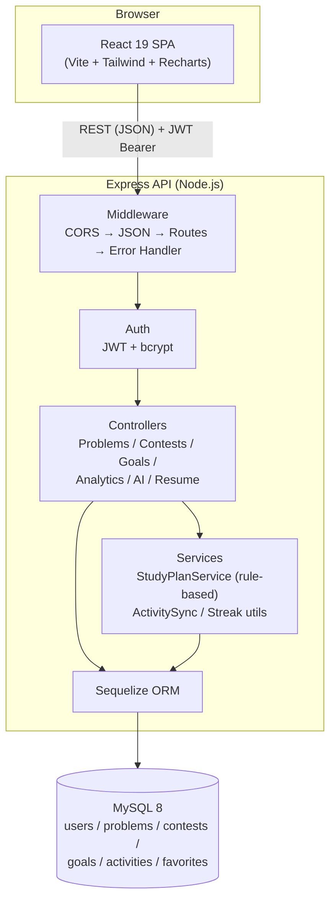

# Architecture

## System overview



## Backend layering (MVC + services)

```
backend/src/
  config/         # env loading, Sequelize connection
  models/         # Sequelize models + associations (the "M")
  controllers/    # request/response handling per resource (the "C")
  routes/         # Express routers, wire validators -> controllers
  middleware/     # auth (JWT), validation, centralized error handling
  validators/     # express-validator chains per resource
  services/       # business logic with no HTTP concerns (studyPlanService)
  utils/          # small pure helpers (ApiError, asyncHandler, streak, activitySync)
  database/       # seed script
```

There's no traditional "View" layer on the backend -- the API is the contract, and the React app is the view. Each layer only knows about the one below it: routes depend on controllers, controllers depend on models/services, services depend on models. Controllers never touch `req`/`res` logic that belongs in middleware (auth, validation), and models never contain HTTP-aware code.

## Key design decisions

- **Goal progress is computed, not stored.** `goals` has no `solved_count` column -- `goalController.withProgress()` counts matching `problems` rows at read time. One source of truth, no denormalization drift.
- **Streaks and the heatmap read from `activities`, not `problems`.** Scanning every problem to compute a streak on every dashboard load doesn't scale; `activities` is a pre-aggregated daily rollup kept in sync by `utils/activitySync.js` inside the same transaction as every problem create/update/delete.
- **The AI Study Planner is 100% rule-based** (`services/studyPlanService.js`) -- a static topic-progression graph plus a small table of company interview profiles, no external API calls, no API key, no network dependency, no cost, and no risk of hallucinated advice.
- **Every list endpoint enforces `WHERE user_id = req.user.id`** at the controller level (not just in a shared base class), and it's covered by an explicit test: a second user attempting to read/update/delete another user's problem or contest gets a `404`, not a `403` -- the record's existence isn't leaked to users who don't own it.
- **JWT, not sessions.** Stateless auth keeps the API horizontally scalable and matches the SPA + separately-hosted-frontend deployment target (GitHub Pages-style or Vercel frontend, Render backend, different origins).

## Frontend structure

```
frontend/src/
  api/            # one thin axios wrapper module per backend resource
  context/        # AuthContext (JWT + user), ThemeContext (dark mode)
  components/     # ui/ (generic), layout/, and one folder per feature
  pages/          # one top-level route component per page, lazy-loaded
  hooks/          # useDebounce, etc.
```

Route-level code splitting (`React.lazy` + `Suspense` in `App.jsx`) keeps the initial JS payload small -- heavy dependencies like Recharts and jsPDF only load when the user actually visits Analytics/Contests or Resume Mode, not on first paint.
