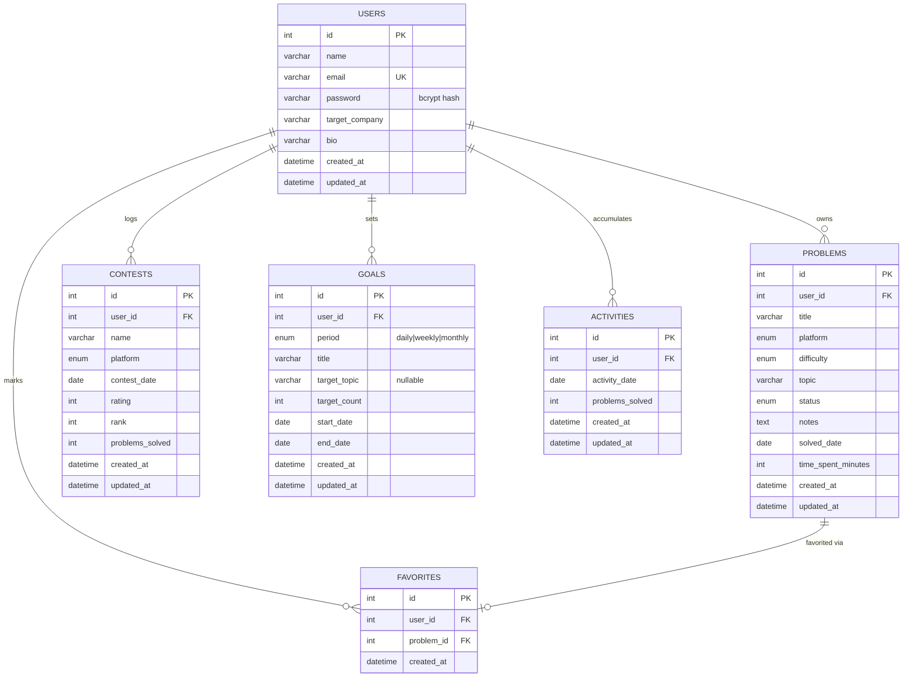

# Entity-Relationship Diagram

## Design notes

- **`goals` stores no progress/completion columns.** Progress is computed at read time by counting matching rows in `problems` (filtered by `solved_date` within `[start_date, end_date]` and, optionally, `topic`). This avoids a denormalized counter going stale if a problem is later edited or deleted.
- **`activities` is a daily rollup, not a raw event log.** One row per `(user_id, activity_date)`, incremented/decremented by `backend/src/utils/activitySync.js` whenever a problem's `status`/`solved_date` changes. It exists purely so the streak calculation and the analytics heatmap don't have to re-scan all of `problems` on every request.
- **`favorites` is a proper join table**, not a boolean column on `problems`, even though today a favorite can only reference a problem owned by the same user. This keeps the schema extensible (e.g. a future shared/public problem set) and demonstrates the many-to-many pattern explicitly.
- Every child table cascades on `user_id` (`ON DELETE CASCADE`) so deleting a user cleans up all of their data automatically.
